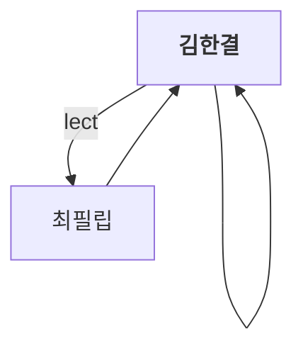
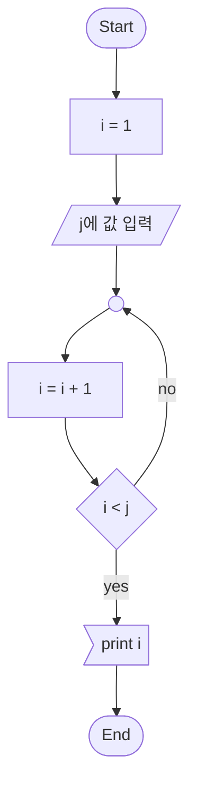
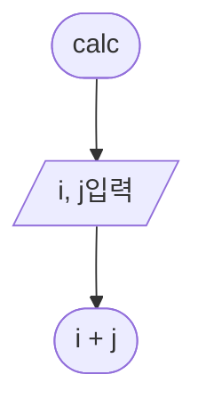
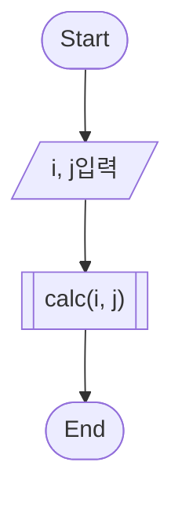
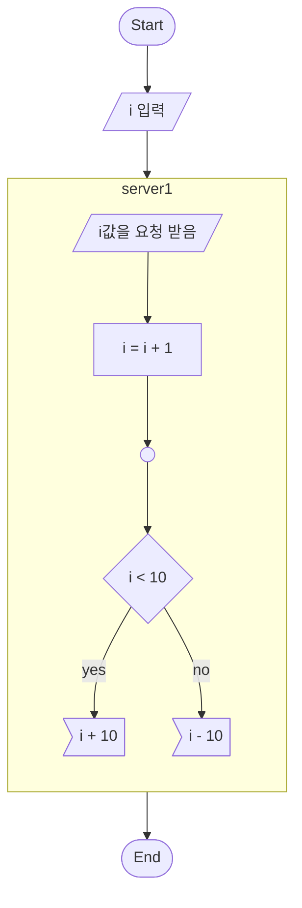

# test 폴더

여기 테스트임.

```mermaid
flowchart TB
    p1["<strong>김한결</strong>"]
    p2["최필립"]
    p1 -->|"lect"| p2
    p1 --> p1
    p2 --> p1
```

```mermaid
flowchart TB
    st(["Start"])
    p1["i = 1"]
    inp1[/j에 값 입력/]
    bl((" "))
    p2["i = i + 1"]
    cond1{"i < j"}
    out1>"print i"]
    en(["End"])
    st --> p1
    p1 --> inp1
    inp1 --> bl
    bl --> p2
    p2 --> cond1
    cond1 -->|"yes"| out1
    cond1 -->|"no"| bl
    out1 --> en
```

```mermaid
flowchart TB
    st(["calc"])
    inp1[/i, j입력/]
    en(["i + j"])
    st --> inp1 --> en
```

```mermaid
flowchart TB
    st(["Start"])
    inp1[/i, j입력/]
    calc[["calc(i, j)"]]
    en(["End"])
    st --> inp1 --> calc --> en
```

```mermaid
flowchart TB
    st(["Start"])
    inp1[/i 입력/]
    en(["End"])
    subgraph s1["server1"]
        direction TB
        inp2[/i값을 요청 받음/]
        p1["i = i + 1"]
        bl1((" "))
        c1{i < 10}
        o1>"i + 10"]
        o2>"i - 10"]
        inp2 --> p1 --> bl1 --> c1 -->|yes| o1
        c1 -->|no| o2
    end
    st --> inp1 --> s1 --> en
```